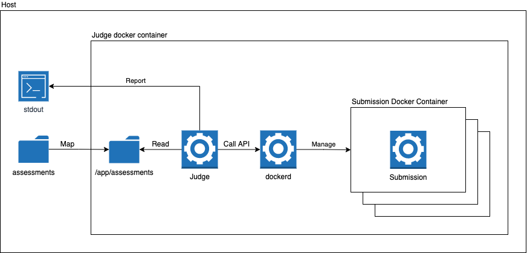

# Candidates' assessments judge.

## About
During an interview potential candidates complete a take-home assignment. 
In the nutshell, the challenge is to write a code that takes input data from the stdin, handles them, and returns the result to the stdout.

## Task
To make candidates' assessments check faster and easier a judge application is needed that can run all candidates' submissions against test data and calculate a score for each of them. The scores should be displayed as the result of the application execution.

## Solution
The current solution is a .NET Core application, that communicates with the docker API to wrap candidates' submissions in docker images and run them as docker containers against test data to check them and generate a report.

For security and usability reasons the application itself wraps in a docker image and could be run as a docker container against a well-structured folder that contains test data and candidates submissions. 

The solution allows to keep all test containers and images in a single place and delete them on complete.

### Package Diagram



## Usage
### Preparation
The solution implies that test data and candidates' submissions are located in a single directory with the following structure:

```console
|-assessments
│   |-codes
|   |   |-01_True.txt
|   |   |-02_False.txt
|   |-submissions
|   |   |-typescript
|   |   |   |-candidate1.ts
|   |   |   |-candidate2.js
|   |   |-python
|   |   |   |-candidate3.py
|   |   |   |-candidate4.py
```

#### Codes

The codes subdirectory should contain codes that need to be used to check submissions. The file name should correspond to the following pattern: 
```console
<SerialNumber>_<ExpectedResult>.txt 
```

where:
```console
<SerialNumber>      - is a serial number of a code;
<ExpectedResult>    - True or False.
```

The regexp that is used to parse a code filename: 
```console
.*_(True|False)\.txt
```

#### Submissions
The submissions subdirectory should contain candidates' submissions. Each submission should be placed in the corresponding subfolder depending on in what language it was written.
The current version supports the following languages:
* typescript
* python

A submission should be a single file that contains all necessary inside.

### Run
To run the application the assessments directory should be mapped to the /app/assessments directory in its docker container. The following command runs the application:

```console
docker run --privileged -it -v assessments:/app/assesments shumutun/bluescape-judge:1.0
```
The first runs of each type of submission (for each language) will take additional time to download and cache its base images (e.g., python base image, node base image, etc.).

The results of checks will be printed in the console for evaluation. 

## Related repos
* [.NET Core](https://github.com/dotnet/core/): the platform the application runs on
* [Docker:dind](https://github.com/docker): a base image that allows running docker in docker. It runs a dockerd process inside a container which provides an API to manage images and containers
* [Docker.DotNet](https://github.com/dotnet/Docker.DotNet): a .NET Core library that wraps the docker API and provides the ability to communicate with it in a .NET Core application
* [SharpZipLib](https://github.com/icsharpcode/SharpZipLib): a .NET Core library that allows wrapping necessary data in a TAR structure to pass it for a docker image building. 
